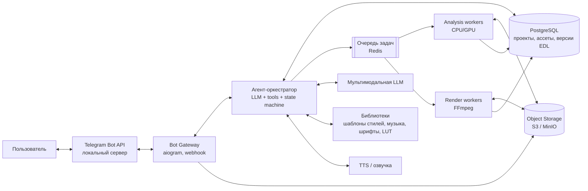
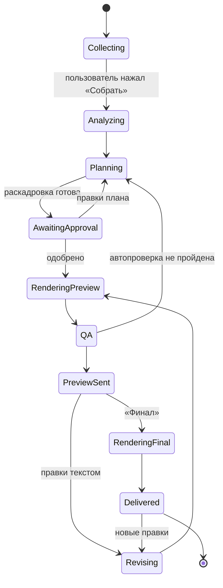
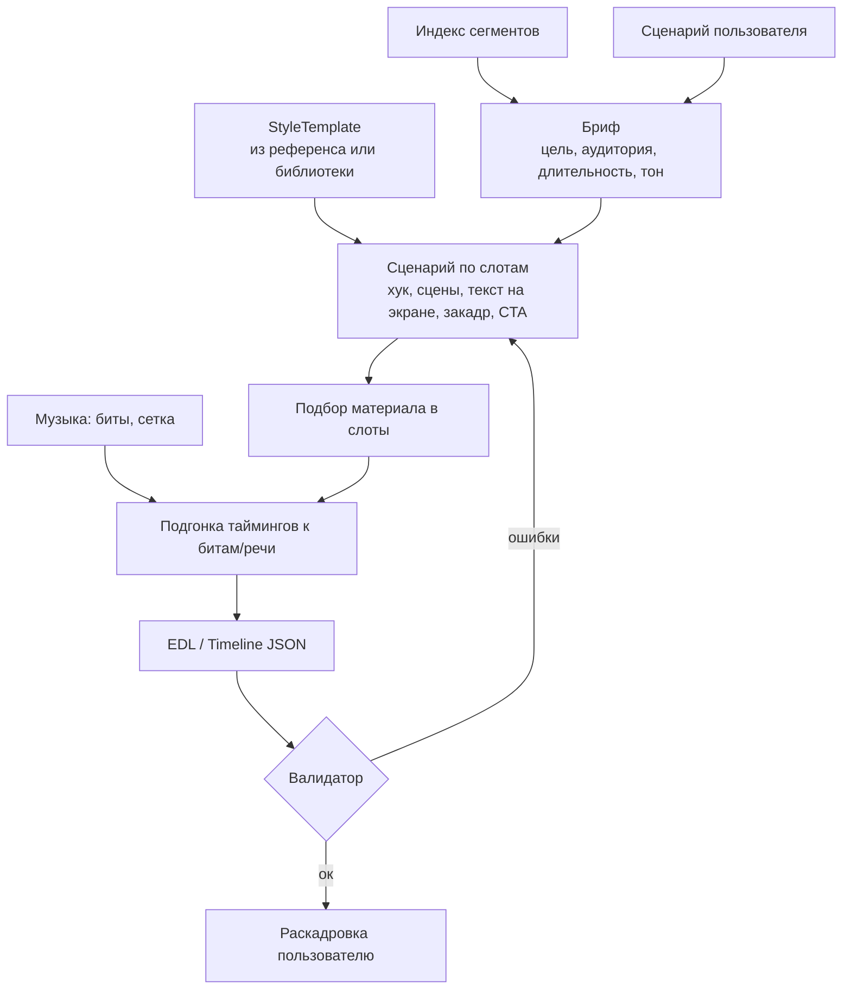

# Архитектура ИИ-агента для монтажа Reels / TikTok

Документ описывает архитектуру сервиса, который по фото, видео, примерному сценарию
и (опционально) ролику-референсу автоматически монтирует вертикальный ролик 9:16
для Instagram Reels / TikTok. Интерфейс пользователя — Telegram-бот.

---

## 1. Задача и сценарии использования

**Вход** (в любой комбинации):

| Тип входа | Как приходит в бот | Для чего используется |
|---|---|---|
| Фото | фото / альбом / файл-документ | кадры ролика (с анимацией Ken Burns, параллакс) |
| Видео | видео / альбом / файл-документ | основной материал, нарезка |
| Примерный сценарий | текст или голосовое сообщение | структура, закадровый текст, подписи |
| Ролик-референс | видеофайл или ссылка | «сделай так же»: ритм, структура, стиль текста, переходы |
| Музыка / голос | аудиофайл | звуковая дорожка, озвучка |

**Выход:** готовый MP4 1080×1920, 30 fps, H.264 + AAC, громкость −14 LUFS,
плюс (опционально) текст описания и хэштеги.

**Режимы работы:**

- **A. Без референса, без сценария** — «сделай ролик из этого»: агент сам
  анализирует материал, придумывает хук и структуру, выбирает шаблон стиля.
- **B. Без референса, со сценарием** — агент раскладывает сценарий по сценам и
  подбирает под каждую сцену лучший кусок материала.
- **C. С референсом** — агент извлекает из референса «стилевой шаблон»
  (тайминги, структура, стиль титров, переходы, темп под бит) и заполняет его
  материалом пользователя.
- **D. Референс/сценарий без своего материала** (расширение) — недостающие
  сцены берутся из стоков или генеративных видеомоделей.

Ключевой принцип: **LLM не монтирует видео напрямую**. LLM принимает решения и
выдаёт строго типизированный план монтажа (EDL/timeline JSON), а детерминированный
рендерер превращает этот план в видео. Это делает результат воспроизводимым,
дешёвым для правок и проверяемым.

---

## 2. Общая схема



Слои:

1. **Интерфейс** — Telegram-бот (приём медиа, диалог, согласование, выдача).
2. **Оркестрация** — агент на LLM с набором инструментов и явной машиной состояний проекта.
3. **Понимание контента** — анализ материала пользователя и референса (CV/ASR/LLM-vision).
4. **Планирование** — сценарий → раскадровка → таймлайн (EDL).
5. **Исполнение** — рендер, контроль качества, доставка.
6. **Инфраструктура** — хранилище, БД, очередь, наблюдаемость.

---

## 3. Telegram-бот (слой интерфейса)

### 3.1. Технологии

- **aiogram 3** (Python, async), режим **webhook**.
- **Локальный сервер Telegram Bot API** (`telegram-bot-api`) — обязателен:
  через облачный Bot API бот может скачать файл не больше 20 МБ и отправить не больше
  50 МБ; локальный сервер снимает ограничение до 2 ГБ и отдаёт файлы прямо с диска.
- Сразу после получения файл перекладывается в S3, в БД создаётся `Asset`.
- Альбомы (media group) собираются в один пакет с дебаунсом ~1–2 с.

### 3.2. Диалог

```
/new                → новый проект
[пользователь присылает фото/видео, текст, голосовое, референс/ссылку]
Бот: «Принял 7 видео, 5 фото, сценарий. Референс: есть.»
     [⏱ 15с] [⏱ 30с] [⏱ 60с]  [🎵 Музыка: авто / своя]  [▶️ Собрать]
Бот: прогресс одним редактируемым сообщением:
     «Анализ материала 3/12… → Разбор референса… → План…»
Бот: раскадровка на согласование:
     альбом из 6–10 ключевых кадров + текстовый план по сценам
     [✅ Рендерить] [✏️ Изменить план] [🔄 Другой вариант]
Бот: превью (480p, быстро) → [✅ Финал] [✏️ Правки]
Пользователь: «хук короче, музыку бодрее, убери 3-ю сцену»
Бот: новая версия (перерендер только по патчу плана)
Бот: финал 1080p + описание + хэштеги (+ файлом-документом без пережатия Telegram)
```

Команды: `/new`, `/status`, `/versions`, `/undo`, `/style` (выбор шаблона),
`/settings` (длительность по умолчанию, язык субтитров, шрифт/бренд-кит).

Голосовые сообщения транскрибируются и обрабатываются как текст.
Каждое действие пользователя — событие в проекте; агент может задать уточняющий
вопрос через inline-кнопки, но по умолчанию действует с разумными значениями
(минимум вопросов — главное UX-правило).

### 3.3. Выдача

- Превью отправляется как `video` (Telegram пережмёт — для превью допустимо).
- Финал — как `video` **и** как `document` (без пережатия, для публикации).
- Хранение версий: пользователь может вернуться к любой (`/versions`).

---

## 4. Агент-оркестратор

### 4.1. Машина состояний проекта

Агенту не даётся «свобода на всё». Жизненный цикл проекта — явный конечный автомат,
а LLM принимает решения внутри каждого состояния.



Состояние хранится в PostgreSQL, поэтому бот переживает рестарты, а долгие задачи
(анализ, рендер) идут асинхронно через очередь.

### 4.2. Инструменты агента (tool use)

| Инструмент | Что делает |
|---|---|
| `analyze_assets(asset_ids)` | запускает анализ материала, возвращает сводку (сцены, описания, качество, речь) |
| `analyze_reference(asset_id \| url)` | строит `StyleTemplate` из ролика-референса |
| `list_style_templates(query)` | ищет готовые шаблоны стиля (режим без референса) |
| `search_segments(query, filters)` | семантический поиск по нарезанным кускам материала |
| `search_music(mood, bpm, duration)` | подбор трека из лицензированной библиотеки |
| `generate_voiceover(text, voice)` | TTS для закадрового голоса |
| `build_timeline(brief, template)` | генерация EDL (структурированный вывод по JSON Schema) |
| `patch_timeline(edl_id, instruction)` | правка EDL в виде JSON Patch |
| `validate_timeline(edl)` | детерминированная проверка EDL |
| `render(edl_id, quality)` | постановка рендера в очередь (preview / final) |
| `inspect_render(render_id)` | ключевые кадры + метрики рендера для самопроверки |
| `ask_user(question, options)` | вопрос пользователю с кнопками |
| `send_storyboard(edl_id)` | отправка раскадровки на согласование |

### 4.3. Распределение моделей

- **Сильная мультимодальная модель** — планирование: бриф, сценарий, построение
  EDL, разбор референса на уровне смысла, интерпретация правок.
- **Быстрая дешёвая модель** — массовые операции: описание кадров, теги,
  классификация сцен, генерация подписей/хэштегов.
- **Специализированные модели** (не LLM) — всё, что считается точно и дёшево:
  детекция склеек, ASR, биты, OCR, лица, эмбеддинги.

Правило: всё, что можно посчитать алгоритмом, считается алгоритмом; LLM получает
уже сжатые структурированные факты, а не сырые кадры целиком.

---

## 5. Понимание контента

### 5.1. Конвейер анализа материала пользователя

Для каждого ассета (параллельно, в воркерах):

1. **Нормализация и прокси** — `ffprobe` (кодек, fps, поворот, HDR, длительность);
   прокси 540p/низкий битрейт для анализа и быстрого превью. Фото — EXIF-поворот, ресайз.
2. **Детекция сцен** — PySceneDetect (content/adaptive detector) → список шотов.
3. **Ключевые кадры** — 1–3 кадра на шот (по резкости и представительности).
4. **Технические оценки** — резкость (вариация Лапласиана), экспозиция, шум,
   тряска (оптический поток), наличие движения, «мусорные» куски (карман, пол, смаз).
5. **Семантика** — описание кадров мультимодальной моделью (кто/что/где/действие/эмоция),
   теги; эмбеддинги (CLIP/SigLIP) для семантического поиска.
6. **Лица и объекты** — детекция лиц/людей, карта значимости (saliency) — для умного
   кадрирования 16:9 → 9:16 и фото → 9:16.
7. **Речь** — Whisper (с таймкодами слов) + VAD; если человек говорит в кадр, это
   «говорящая» сцена: её нельзя резать посреди фразы.
8. **Аудио** — есть ли музыка/шум, громкость.

Результат — **индекс сегментов**: каждая запись = (ассет, in, out, описание, теги,
эмбеддинг, оценка качества, лица/якорь кадрирования, речь). Индекс хранится в Postgres
(`pgvector` для эмбеддингов).

### 5.2. Разбор ролика-референса → `StyleTemplate`

Референс анализируется тем же конвейером плюс дополнительными шагами:

| Что извлекаем | Как |
|---|---|
| Монтажный ритм | склейки → длительности шотов, кривая темпа (быстро в начале, медленнее в середине и т.п.) |
| Синхронизация с музыкой | детекция битов/онсетов (librosa / madmom); доля склеек, попадающих в бит |
| Структура | LLM по описаниям шотов + транскрипту: хук (0–3 с) → развитие → кульминация → CTA |
| Роль каждого шота | «крупный план лица», «продукт в руке», «общий план локации», «B-roll», «до/после»… |
| Тип кадра и движение | крупность, движение камеры, скорость (slow-mo / ускорение) |
| Текст на экране | OCR (PaddleOCR) по кадрам → тексты, позиции, тайминги появления, стиль (цвет, обводка, плашка, регистр) |
| Субтитры | есть ли «караоке»-субтитры, сколько слов на экран, позиция |
| Переходы | hard cut / zoom / whip / flash / glitch — классификация по соседним кадрам |
| Цвет | средняя палитра и тон → подбор ближайшего LUT из библиотеки |
| Звук | музыка / закадр / речь в кадр, темп речи |

Выход — `StyleTemplate` (JSON), пример:

```json
{
  "duration_s": 21.4,
  "aspect": "9:16",
  "bpm": 124,
  "cut_on_beat_ratio": 0.82,
  "structure": [
    {"slot": 1, "role": "hook", "start": 0.0, "dur": 1.2,
     "shot": {"type": "close_up", "subject": "face", "motion": "push_in"},
     "text": {"content_role": "hook_question", "style": "bold_white_black_stroke", "pos": "center"},
     "transition_out": "whip"},
    {"slot": 2, "role": "broll", "start": 1.2, "dur": 0.5, "shot": {"type": "detail"}},
    {"slot": 9, "role": "cta", "start": 19.0, "dur": 2.4,
     "text": {"content_role": "cta", "style": "pill_label", "pos": "lower_third"}}
  ],
  "captions": {"enabled": true, "words_per_screen": 3, "highlight_active_word": true},
  "color": {"lut": "warm_film_02"},
  "audio": {"music": true, "voiceover": false}
}
```

**Важно про права:** из референса берётся только *структура и стиль*. Кадры, музыка
и текст референса в итоговый ролик не попадают. Музыка — из лицензированной
библиотеки или от пользователя (либо пользователь добавляет трендовый звук уже
в приложении TikTok/Instagram — бот может подсказать, какой).

Ссылки на ролики (TikTok/Instagram) загружаются через `yt-dlp` только если это
допустимо условиями платформ в вашей юрисдикции; надёжный путь — пользователь
пересылает сам файл.

### 5.3. Режим без референса

Библиотека **готовых `StyleTemplate`**, размеченных по жанрам и задачам:
«тревел-влог», «до/после», «распаковка», «рецепт», «топ-5», «день из жизни»,
«говорящая голова + B-roll», «слайд-шоу фото под бит» и т.д.
Агент выбирает шаблон (или 2–3 варианта) по содержимому материала и сценарию.
Библиотеку можно пополнять автоматически: каждый разобранный референс (после
обезличивания) становится кандидатом в шаблоны.

---

## 6. Планирование ролика

### 6.1. Шаги



1. **Бриф.** LLM формулирует: о чём ролик, целевая длительность, тон, язык,
   главный «хук». Если сценария нет — генерирует его сама по материалу.
2. **Сценарий по слотам.** Сценарий раскладывается на слоты шаблона: для каждого —
   роль, желаемое содержание кадра (текстовый запрос), текст на экране, реплика закадра.
3. **Подбор материала (matching).**
   - Для каждого слота — top-K кандидатов из индекса сегментов по семантике
     (эмбеддинг запроса ↔ эмбеддинги сегментов) + фильтры (крупность, наличие лица,
     движение, качество).
   - Глобальное назначение без повторов — задача о назначениях (венгерский алгоритм)
     со стоимостью = семантическое несоответствие + штраф за качество + штраф за
     несоответствие длительности + штраф за повтор ассета.
   - LLM проверяет итоговую раскладку по превью-кадрам и может переставить.
4. **Тайминги.**
   - При наличии музыки: сетка битов/тактов; склейки притягиваются к ближайшим битам
     (с учётом `cut_on_beat_ratio` шаблона), акцентные моменты — к сильным долям/дропу.
   - Говорящие сцены режутся по границам фраз (таймкоды слов Whisper), а не по битам.
   - Внутри сегмента выбирается лучшее окно нужной длины (пик движения/резкости/эмоции).
5. **Оформление.** Текст на экране, субтитры по словам, переходы, скорость, LUT,
   зум/Ken Burns для фото, кадрирование по якорю (лицо/объект) с плавной траекторией.
6. **Аудио.** Музыка (обрезка по фразам трека, fade), закадр TTS или голос
   пользователя, ducking музыки под речь, нормализация громкости.

### 6.2. EDL — центральный контракт

Весь монтаж описывается одним JSON-документом, который валидируется по JSON Schema.
LLM генерирует его через structured output / tool call — никакого «свободного» текста.

```json
{
  "version": 3,
  "canvas": {"w": 1080, "h": 1920, "fps": 30},
  "duration_s": 21.0,
  "tracks": {
    "video": [
      {"id": "c1", "asset": "a_17", "src_in": 3.40, "src_out": 4.60,
       "at": 0.0, "speed": 1.0,
       "reframe": {"mode": "track", "anchor": "face_0", "zoom": [1.0, 1.08]},
       "color": {"lut": "warm_film_02", "intensity": 0.7},
       "transition_in": null, "transition_out": {"type": "whip", "dur": 0.2}},
      {"id": "c2", "asset": "p_03", "kind": "photo", "at": 1.2, "dur": 0.5,
       "motion": {"type": "ken_burns", "from": [0.5, 0.5, 1.0], "to": [0.55, 0.45, 1.15]}}
    ],
    "text": [
      {"at": 0.0, "dur": 1.2, "content": "Вот что я нашла на рынке 👀",
       "style": "bold_white_black_stroke", "pos": "center", "anim": "pop"}
    ],
    "captions": {"source": "voiceover", "words_per_screen": 3, "style": "karaoke_yellow"},
    "audio": [
      {"type": "music", "track": "m_204", "src_in": 12.0, "at": 0.0, "dur": 21.0,
       "gain_db": -6, "duck_under": "voiceover", "fade_out": 1.0},
      {"type": "voiceover", "asset": "tts_1", "at": 0.3}
    ]
  },
  "safe_zones": "tiktok",
  "meta": {"caption": "…", "hashtags": ["#…"]}
}
```

### 6.3. Валидатор (детерминированный)

- Схема JSON, ссылки на существующие ассеты, `src_in/src_out` в пределах исходника.
- Нет «дыр» и нежелательных наложений на таймлайне; итоговая длительность в допуске.
- Минимальная длительность шота (≥ ~0.3 с), фразы не обрезаны посередине.
- Текст не попадает в **безопасные зоны** интерфейса TikTok/Reels (верх, правая колонка
  кнопок, нижняя подпись); длина строки и размер шрифта читаемы.
- Разрешение источника достаточно для выбранного зума (не апскейлим > ~1.5×).
- Ошибки возвращаются LLM как структурированный список — она исправляет план
  (обычно 1–2 итерации).

### 6.4. Правки

Правка на естественном языке («хук короче», «убери 3-ю сцену», «музыку повеселее»,
«текст крупнее») превращается LLM в **JSON Patch к EDL**, а не в новый план с нуля.
Это сохраняет всё, что пользователю уже понравилось, и позволяет `/undo` и историю
версий (`edl_versions`). Перерендер — только затронутых фрагментов (см. 7.2).

---

## 7. Рендер и контроль качества

### 7.1. Движок

- **Основной путь — FFmpeg**, компилятор EDL → `filter_complex`:
  `trim/setpts` (нарезка, скорость), `crop/scale/zoompan` (рефрейм, Ken Burns),
  `xfade` (переходы), `lut3d` (цвет), `overlay`, `sidechaincompress` (ducking),
  `loudnorm` (−14 LUFS).
- **Текст и субтитры** — через **ASS + libass** (обводки, плашки, караоке-подсветка слов,
  анимации появления); сложные анимированные элементы — предрендер PNG-последовательностей
  с альфой (Pillow/Skia) и `overlay`.
- **Альтернатива для богатой моушн-графики** — Remotion (React → видео) как второй
  рендерер того же EDL; вводится при необходимости, контракт EDL не меняется.
- Кодирование: H.264 High, 1080×1920, 30 fps, CRF ~18–20 / 8–12 Мбит/с, AAC 48 кГц,
  `+faststart`. При наличии GPU — NVENC для превью.

### 7.2. Скорость

- Превью рендерится из прокси в 540p с `ultrafast` — несколько секунд.
- Финал — из оригиналов.
- Кеш «клипов»: каждый элемент видеодорожки рендерится в промежуточный файл,
  ключ кеша = хэш его параметров; при правке пересобираются только изменённые клипы,
  затем быстрая склейка + аудио.

### 7.3. Автоматический QA

После рендера и до отправки пользователю:

- **Технический:** длительность, разрешение, отсутствие чёрных/застывших кадров
  (`blackdetect`, `freezedetect`), громкость (`ebur128`), рассинхрон аудио.
- **Визуальный:** 1 кадр на шот + кадры с текстом отправляются мультимодальной модели
  с чек-листом: читаем ли текст, не закрыто ли лицо текстом, нет ли смазанного/пустого
  кадра, работает ли хук в первые 1–2 с, соответствует ли ролик брифу/референсу.
- При провале — возврат в `Planning` с замечаниями (ограничение: 2 автоитерации).

---

## 8. Данные и инфраструктура

### 8.1. Модель данных (PostgreSQL)

```
users(id, tg_id, settings_json, brand_kit_json, plan, created_at)
projects(id, user_id, state, brief_json, template_id, current_edl_version, created_at)
assets(id, project_id, kind[video|photo|audio|reference|voice], s3_key, proxy_key,
       probe_json, analysis_status, analysis_json)
segments(id, asset_id, src_in, src_out, description, tags[], quality, faces_json,
         speech_json, embedding vector)
style_templates(id, source[library|reference], genre, template_json, embedding vector)
edl_versions(id, project_id, version, edl_json, parent_version, change_note, created_at)
renders(id, edl_version_id, quality[preview|final], status, s3_key, qa_json, duration_ms)
music_tracks(id, title, license, bpm, mood[], beats_json, s3_key)
events(id, project_id, type, payload_json, created_at)   -- журнал диалога и действий
```

### 8.2. Сервисы и развёртывание

| Сервис | Технологии | Масштабирование |
|---|---|---|
| `bot-gateway` | Python, aiogram 3, FastAPI (webhook) | горизонтально, stateless |
| `telegram-bot-api` | официальный локальный сервер | 1 экземпляр + общий том |
| `orchestrator` | Python, LLM SDK, state machine | горизонтально, stateless |
| `analysis-worker` | FFmpeg, PySceneDetect, Whisper, OpenCV, CLIP/SigLIP, PaddleOCR, librosa | GPU-очередь + CPU-очередь |
| `render-worker` | FFmpeg (+libass, lut3d), Pillow/Skia | CPU (или GPU с NVENC), автоскейлинг по длине очереди |
| Очередь | Redis + Celery/Dramatiq (MVP); Temporal — если нужны сложные долгие workflow с ретраями | — |
| Хранилище | S3 / MinIO, lifecycle: исходники 30 дней, прокси 7 дней | — |
| БД | PostgreSQL + pgvector | — |
| Наблюдаемость | OpenTelemetry, Prometheus/Grafana, Sentry; трассировка вызовов LLM (промпты, токены, стоимость) | — |

Всё упаковано в Docker, локально — `docker compose`, в проде — Kubernetes
или несколько VM с GPU для анализа.

### 8.3. Надёжность и безопасность

- Идемпотентные задачи (ключ = хэш входа), ретраи с backoff, дедупликация апдейтов Telegram.
- Лимиты на пользователя: размер/количество файлов, число рендеров в сутки, длина ролика.
- Модерация входного контента (NSFW/насилие) перед обработкой.
- Секреты — в менеджере секретов; ссылки на файлы S3 — только presigned и короткоживущие.
- Удаление данных пользователя по команде (`/delete_my_data`).

---

## 9. Оценка времени обработки (ориентир)

Для проекта «10 видео по ~30 с + 5 фото → ролик 30 с»:

| Этап | Ориентировочно |
|---|---|
| Загрузка и прокси | 10–30 с |
| Анализ материала (параллельно, GPU) | 30–90 с |
| Разбор референса | 20–60 с |
| План + валидация (LLM) | 15–40 с |
| Превью 540p | 5–15 с |
| Финал 1080p | 20–60 с |

Итого ≈ 2–4 минуты до первого превью; правка — 15–40 секунд благодаря
патчам EDL и кешу клипов.

---

## 10. Структура репозитория (предлагаемая)

```
ai-reels-creator/
├── docs/ARCHITECTURE.md
├── services/
│   ├── bot/                 # aiogram: хендлеры, клавиатуры, сборка альбомов
│   ├── orchestrator/        # state machine, агент, инструменты, промпты
│   ├── analysis/            # сцены, качество, ASR, OCR, биты, эмбеддинги, референс
│   └── render/              # компилятор EDL → ffmpeg, ASS-генератор, кеш клипов, QA
├── packages/
│   ├── edl/                 # JSON Schema + pydantic-модели EDL и StyleTemplate, валидатор
│   └── common/              # S3, БД, очередь, конфиги, логирование
├── assets/
│   ├── templates/           # библиотека StyleTemplate
│   ├── luts/  fonts/  sfx/
├── migrations/
├── tests/                   # golden-тесты: EDL → рендер → сравнение кадров
└── docker-compose.yml
```

Пакет `packages/edl` — главный контракт между агентом и рендерером; его стоит
сделать первым и покрыть тестами.

---

## 11. План разработки

**MVP (2–4 недели)**
- Бот: приём медиа и текста, кнопки длительности, выдача видео.
- Анализ: прокси, сцены, качество, описания кадров, Whisper.
- 5–7 шаблонов стиля из библиотеки, без референсов.
- EDL + валидатор + FFmpeg-рендер: нарезка, кадрирование по центру/лицу, Ken Burns,
  текст через ASS, музыка из небольшой библиотеки с битами.
- Правки текстом через JSON Patch.

**v1**
- Разбор референсов → `StyleTemplate` (ритм, структура, OCR-текст, биты, переходы, LUT).
- Караоке-субтитры, TTS-озвучка, ducking, трекинг-рефрейм.
- Автоматический визуальный QA, кеш клипов, несколько вариантов на выбор.
- Бренд-кит пользователя (шрифты, цвета, логотип).

**v2**
- Режим D: стоки и генеративное видео для недостающих сцен.
- Автопубликация (TikTok Content Posting API, Instagram Graph API).
- Обучение на обратной связи: какие варианты пользователи выбирают/правят →
  ранжирование шаблонов и кандидатов; A/B хуков.
- Web-редактор таймлайна поверх того же EDL (Telegram Mini App).

---

## 12. Ключевые архитектурные решения (кратко)

1. **LLM планирует, код исполняет.** Контракт — типизированный EDL; рендер детерминирован.
2. **Референс → StyleTemplate.** Стиль отделён от контента: один и тот же движок
   работает и с референсом, и с библиотечным шаблоном, и без него.
3. **Факты считает CV/DSP, смысл — LLM.** Склейки, биты, речь, OCR, качество —
   алгоритмами; LLM получает компактную структурированную сводку.
4. **Правки — патчами.** Версионирование EDL, быстрые итерации, `/undo`.
5. **Явная машина состояний** проекта поверх асинхронной очереди — устойчивость к
   рестартам и долгим операциям.
6. **Локальный Telegram Bot API** — большие файлы без ограничений облачного API.
